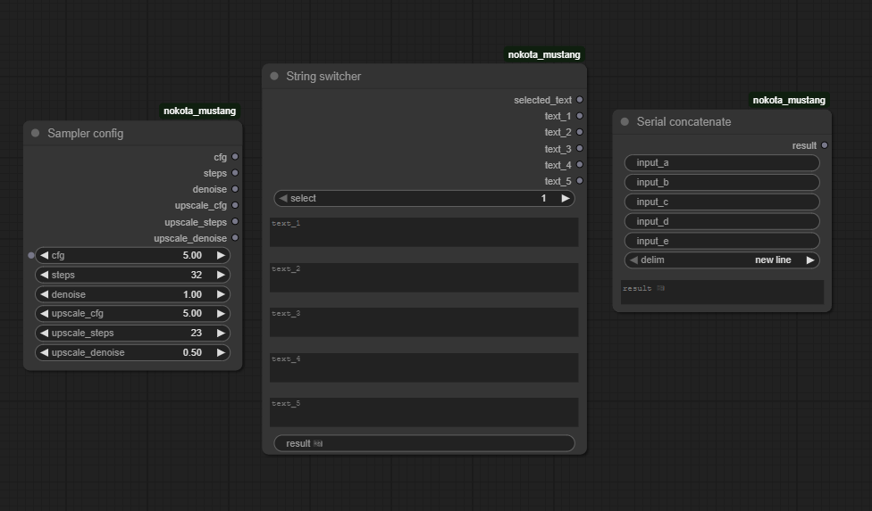

# ComfyUI Nokota Mustang nodes

I added my nodes that I am building for public use.

Motivation: I just wanted more features that are not available out there, and to learn how ComfyUI and LiteGraph nodes work.

Post feedback or requests for nodes and features, I will be active in this area for a while.

_First three nodes available. The Random uINT makes a random unsigned integer on activation and you can store a lock value and toggle it when needed. The Dimension base attempts to simplify image size by providing an aspect ratio and a target mega pixel count. The Dimension multiplier simply allows scaling up of integer width and height dimensions._

_Sampler config is a simple input area for my KSamplers. The string switcher allows you to switch between 5 multi-line strings; or just use them as outputs. The serial concatenate allows you to combine up to 5 strings together (while ignoring empty ones)._

The subsections will describe the nodes included in this repo.

Installation for now is simple, download the repo and copy the node folders into the `ComfyUI/custom_nodes` directory. I will work on adding this to the manager in the app soon.

## Dimension base

This node is my attempt to standardize image dimension sizes, I'm fed up of manually inputting values and having the default input fields clip or change the values, or just human error and inputting something off by a few pixels.

The drop down field will contain a fixed set of aspect ratios, and when the node is generated it will calculate the correct pixel width and height given the megapixel input.

I included the so-to-say 'standard ratios' that relate to real world products, but since some standards are fixed (say mostly in landscape) I added a portrait version (and vice-versa).

The ratio is easy to understand, but take note of the target mega pixels input. This is a base value used to calculate the final dimension given your target ratio; if you wanted to create Full HD for example you can pick `Landscape HD (16:9)` and `2 million (base 1440 ~Full HD)`.

The stable diffusion base resolutions 512 and 1024 will be handy for creating base model images. I use `Landscape (3:2)` for my images right now, with target pixels to `1 million (SDXL base 1024)`; resulting in an image size of `1248 by 832`.

## Dimension multiplier

A simple node to take in a width and height and a scaler float, and produce a correct upscale. To produce the correctly rounded pixel sizes, ideally you want to provide a scale of 0.5, 1.5, 2.0, 4.0, 8.0, etc.

Given the example of `1248 by 832`, I am upscaling at 1.5 for a size of `1872 by 1248`. I can push 2.0x on my GPU if I don't do anything else during decoding, for a upscaled size of `1872 by 1248`.

This is handy for my purpose since I want to create a latent image with the base dimensions, and I want to feed the scaled up dimensions into the upscaler.

## Random uINT

My take on random integer generation since others either focus on providing negative integers (useless), are ~1000 lines long or more?, or don't work intuitively (the base node randomizes after running and you can see the used seed?).

This node will generate a random unsigned integer. If you copy the random number into the lock value manually, you can lock the integer to this number if the lock switch is flipped on.

The number will generate on the node usage, so it's useful for seed generation and preserving the seed in the metadata for recreation.

## String switcher

I wanted to select or switch between strings at will, this does it. Handy if you want to feed in a random uInt as well using the pervious node. You can also use the text as outputs as is.

It is fixed to 5 text entries for now.

## String concatenate

Concatenate up to 5 strings, with a simple selection of the delimiter. Any empty input is ignored.

## Sampler config

I just needed a single node to set some parameters for my KSampler and my upscaler KSampler, that is what this does.

